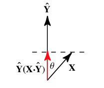

#### Dot Product
it's the sum of the vectors components multiplied - it's 0 when the vectors are *perpendicular*

the projection of vector X onto Y is (where ^ denotes unit vectors):

The dot product therefore has the geometric interpretation as the _length of the projection of X onto the unit vector Y^_ when the two vectors are placed so that their tails coincide.
