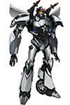
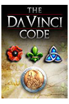

# VALENTIN GALEA

Cambridge, CB24 6XJ, United Kingdom / 07456 891579 / valentin.galea@gmail.com 

## SUMMARY

Over 10 years of professional experience. C++ expert, worked on both video games and applications, PC and mobile development. 

*Skill-set*
+ advanced C++03 and C++11
+ 3D Graphics concepts and algorithms - proficient in _OpenGL_
+ gameplay programming techniques
+ knowledge about _multithreaded_ and _network_ environments
+ pretty fluent in Java and C#. Know a lot about Perfoce, Git and 3D Studio Max. Can manage myself in Jira or Hansoft.

## WORK EXPERIENCE

### Senior Programmer - *JAGEX*

*December 2012 - Present*

*Jagex* are best known for *RuneScape*, the world's largest free-to-play MMORPG. Currently I'm working on a whole different project:

__Transformers Universe__ - a 3D MOBA game based on the popular Transformers franchise. I am a _game engine developer_ dealing with server side infrastructure. I started working on the Chat infrastructure and VOIP system. Then the game changed tech and now I work closely on the Matchmaking and Grouping Servers.

### Technical Director - *GAMBIT SOFTWARE*

*January 2011 - September 2012*

Small indie company that I co-founded with a friend. I helped running it from day 1, being involved in all everyday tasks from technical to managerial. Projects of note:

a __Horse Racing__ game for a casino in the Republic of Ireland - a 2D/3D PC game that simulates horse races gambling. We also did contract work for __Goom Radio__, France - and for __Coca-Cola Hellenic__.

### Senior Programmer - *GAMELOFT*

*September 2009 - January 2011*

A leading global publisher of video and social games, Gameloft creates content for all digital platforms, specializing on smartphones and tablets. I worked the iOS versions of: (recent/bigger projects first)

__Tom Clancy's Splinter Cell__ - I worked on various features like fog effects, night and thermal vision, sniper rifles and world editor enhancements.

__N.O.V.A__ - Besides other things, I was chiefly involved in implementing an in-game proprietary online store.

__Asphalt 5__ - I joined towards the end of the project, being in charge of the demo version.

### (Lead) Programmer - *NEWROSOFT RESEARCH & DEVELOPMENT*

*August 2004 - November 2007* (with a break)

Various projects for this company that did contract work for the likes of _Sony Online Entertainment_:

__Shopping Dash__ - casual strategy and time management game; I was acting as team lead and worked on the gameplay, AI, map editor and scripting.

__The Da Vinci Code__ - an adventure, match-3 game based on the popular book and film, I was responsible of converting it from OpenGL to DirectX.

__Bewitched__ - a game based on the hit TV series, I implemented the main match-3 mechanic, board fill algorithms and other various gameplay features.

some unreleased projects like the Nintendo DS game __Cheggers Party Quiz__ and one of the first MMO attempts __Age of Mourning__

### Programmer - Quake 3 Arena modding

*2002 – 2003*

Freelance work on a total-conversion of Quake 3 Arena for IMU Studios in Canada. I worked on integrating new features like inventory and new powerups items. I worked directly on the coding keeping in touch with the other members of the team via IRC.

### Personal Projects

[valentingalea.github.com/android-3d-engine/](http://valentingalea.github.io/android-3d-engine/) - 3D engine tech study for Android devices, features light and shadow mapping exercises along with a race track generator – Open Source

[valentingalea.github.com/newpas/](http://valentingalea.github.io/newpas/) - Tech-demo of a Pascal language compiler with custom VM execution that is used as a scripting language for an OpenGL car physics experiment – Open Source
