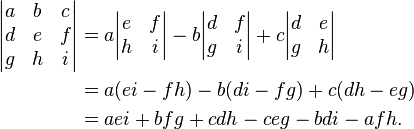
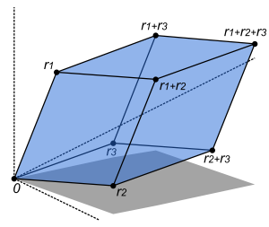
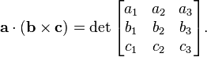

#### Matrix Determinant
The determinant of a 3 x 3 matrix is defined by:

The *area of the parallelogram* is the absolute value of the determinant of the matrix formed by the vectors representing the parallelogram's sides:

The *volume of this parallelepiped* is the absolute value of the determinant of the matrix formed by the rows constructed from the vectors r1, r2, and r3:

Also the determinant of a 3x3 is the *triple product* which is the *volume of the parallelepiped* formed by the 3 row vectors of the matrix:
