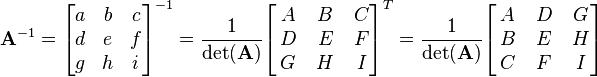
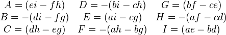

#### Matrix Inverse
An n x n matrix M is invertible if there exists a matrix, which we denote by M^1, such that MM^1 = M^1M = I. The matrix M^1 is called the inverse of M.

Not every matrix has an inverse, and those that do not are called singular. An example of a singular matrix is any one that has a row or column consisting of all zeros.

An n x n matrix M is invertible if and only if determinant(M) != 0.

A quick formula for 3x3 matrices:

For a rotation matrix, the inverse is *the transpose*; also its determinant is 1.
